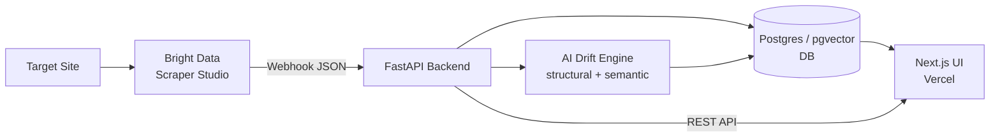
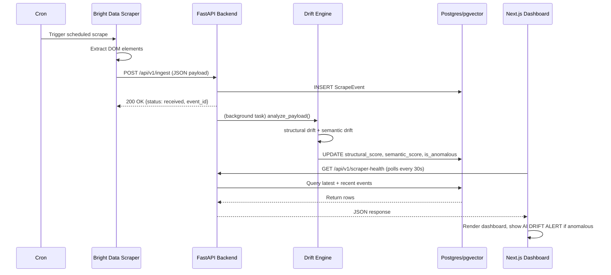
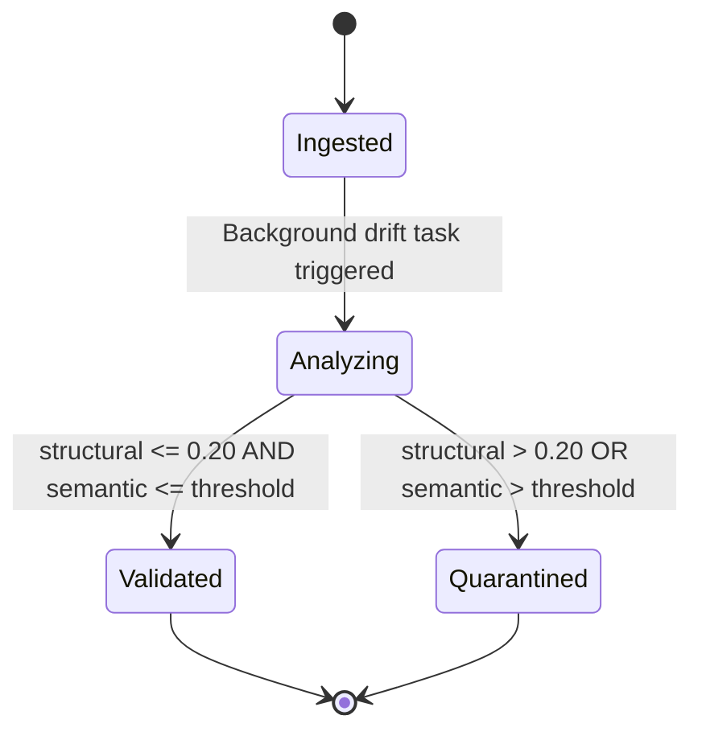

# BioIntel Guardian — Scrapeverse

**An AI-powered integrity layer that catches biomedical web scrapers silently drifting — before corrupted data reaches researchers.**

This is the team manual for everyone working on the project — Warisha (backend), Arsh (frontend), and Tanzeel (ops/integration). It covers how the system works end to end, how to run every piece locally, the API contract all three of you depend on, and the gotchas that have already cost time once so they don't cost time twice.

---

## Table of Contents

- [System Overview](#system-overview)
- [Team & Ownership](#team--ownership)
- [Project Structure](#project-structure)
- [Local Development — Full Setup](#local-development--full-setup)
- [The API Contract](#the-api-contract)
- [The Drift Detection Engine](#the-drift-detection-engine)
- [Sample Payloads & Expected Behavior](#sample-payloads--expected-behavior)
- [Testing](#testing)
- [Deployment](#deployment)
- [Demo-Day Fallback](#demo-day-fallback)
- [Architecture Diagrams](#architecture-diagrams)
- [Gotchas & Troubleshooting](#gotchas--troubleshooting)
- [Contribution Rules](#contribution-rules)

---

## System Overview

1. **Bright Data** scrapes a target site (e.g. ClinicalTrials.gov) and delivers each result as a webhook.
2. **FastAPI** (`POST /api/v1/ingest`) accepts the payload, persists it to **Postgres/pgvector**, and kicks off drift analysis in the background — the request returns immediately, scoring happens async.
3. The **Drift Engine** scores every payload two ways:
   - **Structural drift** — ratio of missing/extra keys vs. the expected 5-key schema. Anomalous if `> 0.20`.
   - **Semantic drift** — cosine distance between the payload's abstract embedding and a baseline embedding. See [The Drift Detection Engine](#the-drift-detection-engine) for the current threshold — the docs and the code don't agree, and you need to know that.
4. Anomalous payloads are marked `is_anomalous` and counted as quarantined.
5. **Next.js** dashboard polls `GET /api/v1/scraper-health` every 30s and renders live confidence scores, source health, and an event timeline, with an "AI DRIFT ALERT" banner when something looks wrong.
6. If the live scraper gets blocked mid-demo, **`mock_webhook_sender.py`** replays pre-saved payloads to `/api/v1/ingest` so the dashboard keeps moving without Bright Data in the loop.

## Team & Ownership

| Person | Role | Owns | Primary files |
| --- | --- | --- | --- |
| **Warisha** | Backend | FastAPI, drift engine, Postgres/pgvector schema | `backend/app/*`, `db/init/01_schema.sql` |
| **Arsh** | Frontend | Next.js dashboard, DOM targeting spec for Bright Data | `frontend/app/*`, `frontend/components/*` |
| **Tanzeel** | Ops / Integration | Bright Data config, Docker Compose, cloud deployment, E2E testing, fallback script, diagrams | `docker-compose.yml`, `mock_webhook_sender.py`, `diagrams/` |

**The API contract in [TDD-sheet.md](TDD-sheet.md) is the single source of truth all three of you share.** If any of the 5 ingest keys or the health-check response shape changes, all three people need to sync before merging — a silent change on one side breaks the other two.

## Project Structure

```
biointel-into-the-scrapeverse/
├── backend/
│   ├── app/
│   │   ├── main.py              # FastAPI app, routes, lifespan
│   │   ├── models.py            # ScrapeEvent, BaselineEmbedding (SQLAlchemy)
│   │   ├── database.py          # Engine/session setup (Postgres in prod, SQLite in tests)
│   │   ├── drift.py             # Structural + semantic drift math, thresholds live here
│   │   ├── drift_adapter.py     # DriftEngine — injectable wrapper used by main.py + tests
│   │   └── services/drift.py    # DriftProcessingService (background task orchestration)
│   ├── tests/test_backend.py    # 6 pytest tests — read this before touching drift.py
│   ├── Dockerfile
│   └── requirements.txt
├── frontend/
│   ├── app/                     # Next.js App Router (page.tsx, layout.tsx, globals.css)
│   ├── components/              # Sidebar, Header
│   ├── _tests/                  # Jest suite
│   ├── next.config.js           # Proxies /api/v1/* to the backend — see Gotchas
│   └── package.json
├── db/init/01_schema.sql        # Postgres/pgvector schema, applied automatically by docker-compose
├── diagrams/                    # Component, Sequence, State Machine, System Overview
├── payloads/                    # Sample JSON payloads — see Sample Payloads table below
├── docker-compose.yml           # db + backend orchestration
├── mock_webhook_sender.py       # Demo-day fallback script
├── TDD-sheet.md                 # API contract + drift math — SOURCE OF TRUTH
├── NOTES.md                     # Domain notes: personas, models, drift math detail
├── payload.md                   # Payload-by-payload behavior log (what triggers what, and why)
├── bashlog.md                   # Commands that have already failed once — check before rerunning
├── biointel-drift-ops/SKILL.md  # Longer-form implementation log & anti-pattern library
├── Integration_Guide.md         # 3-way local/cloud handshake protocol
└── requirements-mock-sender.txt
```

## Local Development — Full Setup

You need all three pieces running to see the whole system work: Postgres+backend (Docker), and the frontend (npm). Everyone on the team runs the same steps — nothing here is ops-only.

### 1. Backend + database

```bash
docker compose up --build
```

Starts `scrapevision_db` (Postgres/pgvector, schema auto-applied from `db/init/01_schema.sql`) and `scrapevision_api` (FastAPI) on `http://localhost:8000`.

```bash
curl http://localhost:8000/health
```

> If port 8000 is already bound from a previous session, `docker compose down` first — see [Gotchas](#gotchas--troubleshooting).

### 2. Frontend

```bash
cd frontend
npm install
npm run dev
```

Runs at `http://localhost:3000`. `next.config.js` proxies `/api/v1/*` to `http://localhost:8000` automatically — no manual CORS/env wiring needed for local dev. The dashboard should show live drift data as soon as both are up.

### 3. Send a real payload through the pipeline

```bash
pip install -r requirements-mock-sender.txt
python mock_webhook_sender.py --url http://localhost:8000/api/v1/ingest --once payloads/sample_01.json
```

### 4. Confirm it landed and scored

```bash
curl http://localhost:8000/api/v1/scraper-health
```

You should see `structural_drift_score` and `semantic_drift_score` populated once the background task finishes (near-instant locally).

## The API Contract

**`POST /api/v1/ingest`** — Bright Data (or `mock_webhook_sender.py`) → Backend

```json
{
  "source_url": "https://...",
  "title": "Phase 3 Trial...",
  "abstract": "The study evaluates...",
  "status": "Recruiting",
  "timestamp": "2026-08-18T20:00:00Z"
}
```
Returns `{"status": "received", "event_id": "<uuid>"}` immediately; drift scoring runs in the background.

**`GET /api/v1/scraper-health`** — Backend → Frontend

```json
{
  "last_run": "2026-08-18T20:05:00Z",
  "status": "anomalous",
  "structural_drift_score": 0.45,
  "semantic_drift_score": 0.82,
  "quarantined_items": 12,
  "recent_runs": []
}
```

| Other endpoint | Method | Purpose |
| --- | --- | --- |
| `/health` | GET | Liveness check |
| `/api/v1/updates` | GET | Non-anomalous events only — the "trustworthy feed" for researchers |
| `/api/v1/all-events` | GET | All events, unfiltered — admin/health view |

Full contract with rationale lives in [`TDD-sheet.md`](TDD-sheet.md) — that file wins if this table and the running code ever disagree.

## The Drift Detection Engine

Lives in `backend/app/drift.py`, wrapped by the injectable `DriftEngine` in `drift_adapter.py` (constructor-injected so tests don't need the real sentence-transformers model or a live DB).

**Structural drift** — `calculate_structural_drift(payload)`: expected keys are `source_url, title, abstract, status, timestamp`. A key counts as missing if it's absent **or** present with an empty/falsy value (`""`, `null`) — this was a real bug fix (see `NOTES.md`), so don't assume a present-but-empty key is "fine."
`drift = (missing + extra) / 5`. **Threshold: `> 0.20` → anomalous.**

**Semantic drift** — `calculate_semantic_drift(text, baseline_vector)`: cosine distance between the incoming abstract's embedding and a baseline embedding (biomedical trial language). Uses `sentence-transformers` (`all-MiniLM-L6-v2`) if it loads successfully, otherwise falls back to a deterministic keyword-overlap encoder (`_keyword_encode`) — this fallback is what tests use, so CI doesn't need the ML model installed.

> ⚠️ **Docs/code mismatch — read this before changing anything.** `TDD-sheet.md`, `NOTES.md`, and the diagrams in `diagrams/` all state the semantic threshold as **`0.35`**. The actual constant in `backend/app/drift.py` is **`SEMANTIC_THRESHOLD = 0.55`**, and that's the value the running API and the pytest suite both use. Until someone reconciles this, treat `0.55` as ground truth for behavior and `0.35` as what the docs currently (incorrectly) say. If you fix one, fix both — and update this note.

`is_anomalous = structural_score > 0.20 OR semantic_score > SEMANTIC_THRESHOLD`.

## Sample Payloads & Expected Behavior

`payloads/` holds fixtures used by `mock_webhook_sender.py` and manual testing. Full write-up with rationale is in [`payload.md`](payload.md); summary:

| File | Shape | Expected result |
| --- | --- | --- |
| `sample_01.json` | All 5 keys, valid biomedical abstract | `structural≈0.0`, `semantic≈0.0`, **not anomalous** |
| `sample_02_protocol_drift.json` | All 5 keys, abstract includes a protocol-amendment note | `structural=0.0`; semantic depends on wording — status changes alone never affect structural drift |
| `sample_03_anomalous.json` | Empty `title`/`status`, missing `timestamp`, cookie-policy-style abstract | `structural=0.8`, semantic high, **anomalous** |

Don't invent new "valid" payloads that omit any of the 5 keys, or use non-biomedical filler text expecting it to pass — both patterns are deliberately drift-triggering and only meant for anomaly tests.

## Testing

**Backend:**
```bash
cd backend
python -m pytest tests/ -q
```
`tests/test_backend.py` sets `DATABASE_URL=sqlite:///test.db` **before** importing the app — this must happen before any `app.*` import or the tests fail with a connection error. If you're writing a new test file, copy that pattern from the top of `test_backend.py`.

6 tests, all currently passing:
1. Valid payload → structural drift within threshold
2. Missing keys → structural drift exceeds threshold → `is_anomalous`
3. Similar biomedical text → semantic drift within threshold
4. Garbage/footer text → semantic drift exceeds threshold → `is_anomalous`
5. `POST /api/v1/ingest` → 200 + `event_id`
6. `GET /api/v1/scraper-health` → correct response shape

**Frontend:**
```bash
cd frontend
npm test
```

## Deployment

Follows the 3-way handshake in [`Integration_Guide.md`](Integration_Guide.md):

1. **Local tunnels** (Warisha + Tanzeel) — Warisha runs the backend locally via ngrok; Tanzeel points the Bright Data webhook at the ngrok URL to confirm the scraper can reach a local DB.
2. **UI wire-up** (Warisha + Arsh) — Arsh's local Next.js points at Warisha's local FastAPI (`localhost:8000`); Warisha allows `localhost:3000` in CORS.
3. **Cloud merge** (Tanzeel) — deploy backend (Render/Railway) and frontend (Vercel). Update the Bright Data webhook to the production backend URL, and set `NEXT_PUBLIC_API_URL` in Vercel to the production backend URL.
4. **E2E validation** (whole team) — trigger a real scrape, confirm it clears the drift check, confirm it renders on the live URL.

| Variable | Used by | Local default | Must change before deploy |
| --- | --- | --- | --- |
| `POSTGRES_USER` / `POSTGRES_PASSWORD` / `POSTGRES_DB` | docker-compose | `appuser` / `changeme` / `scrapevision` | Yes — don't ship the default password |
| `DATABASE_URL` | backend | derived from the above | Set by hosting provider |
| `CORS_ORIGINS` | backend | `http://localhost:3000` | Yes — set to the live Vercel URL |
| `ENV` | backend | `development` | Set to `production` |
| `NEXT_PUBLIC_API_URL` | frontend | `http://localhost:8000` | Yes — set to the live backend URL |

## Demo-Day Fallback

If the target site blocks the scraper right before judging, `mock_webhook_sender.py` replays pre-saved payloads so the dashboard keeps updating:

```bash
# One payload, once — good for quick verification
python mock_webhook_sender.py --url http://localhost:8000/api/v1/ingest --once payloads/sample_01.json

# Loop through all payloads every 10s until judging is over
python mock_webhook_sender.py --url http://localhost:8000/api/v1/ingest --loop --interval 10
```

Point `--url` at the production backend once deployed (e.g. `https://your-backend.onrender.com/api/v1/ingest`). Always pass `--url` explicitly — omitting it stalls the script waiting for input.

## Architecture Diagrams

Rendered from [`diagrams.md`](diagrams.md) — corrected to match the real API (the earlier versions referenced the old `/webhook/scrape` and `/events/recent` routes).

### Component Diagram



### Sequence Diagram — Single Data Pull Lifecycle



### State Machine — ScrapeEvent Lifecycle



Full-resolution SVG exports (for Devpost/slides, where Mermaid won't render) are in [`diagrams/`](diagrams):

| File | Focus |
| --- | --- |
| `ComponentDiagram.svg` | Static version of the component diagram above |
| `SequenceDiagram.svg` | Static version of the sequence diagram above |
| `StateMachineDiagram.svg` | Static version of the state machine above |
| `system_overview.md` / `System_Overview.svg` | Extended low-level version with schema and rate-limiting detail |

## Gotchas & Troubleshooting

Pulled from `bashlog.md` and `biointel-drift-ops/SKILL.md` — check here before re-debugging something the team already hit once.

| Symptom | Cause | Fix |
| --- | --- | --- |
| `docker compose up --build` fails / hangs on port 8000 | A previous container is still bound to the port | `docker compose down` first, or `docker ps` to find and stop the stale container |
| `pytest` fails immediately with a DB connection error | `DATABASE_URL` wasn't set before `app.*` was imported | Set `os.environ["DATABASE_URL"] = "sqlite:///test.db"` as the very first lines of the test file, before any app import |
| `mock_webhook_sender.py` gets a 404 | Pointed at the old route | The correct route is `/api/v1/ingest`, **not** `/webhook/scrape` (an earlier scaffold used the wrong path — fixed, but double-check any saved shell history) |
| Backend hangs or times out on cold start in Docker | `sentence-transformers` imported at module level | Already handled via `_get_model()` lazy-load in `drift.py` — don't reintroduce a top-level import |
| Dashboard shows no data locally | Frontend/backend not both running, or an old `next.config.js` without the `/api/v1/*` rewrite | Confirm both `docker compose up` and `npm run dev` are running; confirm `next.config.js` has the `rewrites()` block |
| Semantic drift behaves differently than `TDD-sheet.md` describes | Known docs/code mismatch — see [The Drift Detection Engine](#the-drift-detection-engine) | Code's `0.55` is what actually runs; treat the `0.35` in the docs as stale until reconciled |

## Contribution Rules

- **Don't restructure `backend/app/`** — `main.py`'s entrypoints and the test suite's imports are wired for the current layout.
- **Don't change drift thresholds** (`0.20` structural, whatever the reconciled semantic value ends up being) without updating `TDD-sheet.md`, `NOTES.md`, `drift.py`, and all affected test assertions in the same change.
- **Don't manually insert a `BaselineEmbedding`** — `seed_baseline()` in `main.py` is idempotent and guards against duplicates.
- **Always run backend tests with `DATABASE_URL=sqlite:///test.db`** set before any app import.
- If you touch the 5-key ingest schema or the `scraper-health` response shape, message the other two people before merging — both sides of that contract are relied on directly.
