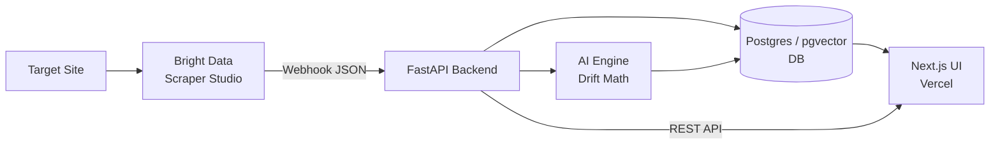
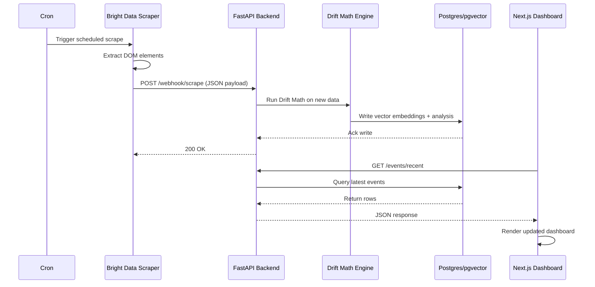
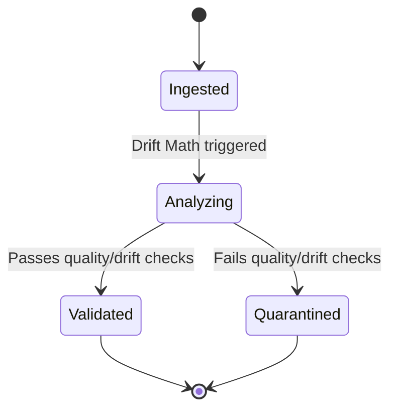

# Architecture Diagrams

## 1. Component Diagram

```mermaid
flowchart LR
    A[Target Site] --> B[Bright Data<br/>Scraper Studio]
    B -->|Webhook JSON| C[FastAPI Backend]
    C --> D[(Postgres / pgvector<br/>DB)]
    C --> E[AI Engine<br/>Drift Math]
    E --> D
    D --> F[Next.js UI<br/>Vercel]
    C -->|REST API| F
```

## 2. Sequence Diagram — Single Data Pull Lifecycle

```mermaid
sequenceDiagram
    participant Cron
    participant Scraper as Bright Data Scraper
    participant API as FastAPI Backend
    participant Engine as Drift Math Engine
    participant DB as Postgres/pgvector
    participant UI as Next.js Dashboard

    Cron->>Scraper: Trigger scheduled scrape
    Scraper->>Scraper: Extract DOM elements
    Scraper->>API: POST /webhook/scrape (JSON payload)
    API->>Engine: Run Drift Math on new data
    Engine->>DB: Write vector embeddings + analysis
    DB-->>API: Ack write
    API-->>Scraper: 200 OK
    UI->>API: GET /events/recent
    API->>DB: Query latest events
    DB-->>API: Return rows
    API-->>UI: JSON response
    UI->>UI: Render updated dashboard
```

## 3. State Machine — ScrapeEvent Lifecycle

```mermaid
stateDiagram-v2
    [*] --> Ingested
    Ingested --> Analyzing: Drift Math triggered
    Analyzing --> Validated: Passes quality/drift checks
    Analyzing --> Quarantined: Fails quality/drift checks
    Validated --> [*]
    Quarantined --> [*]
```
