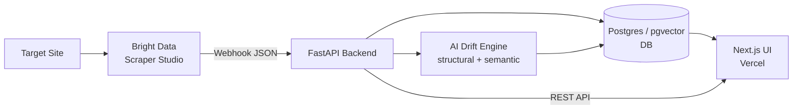
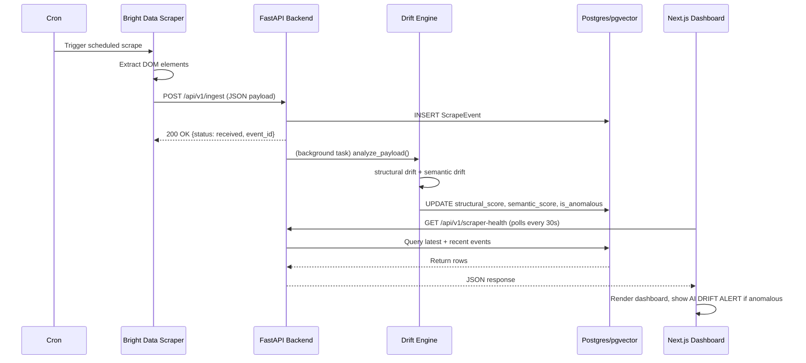
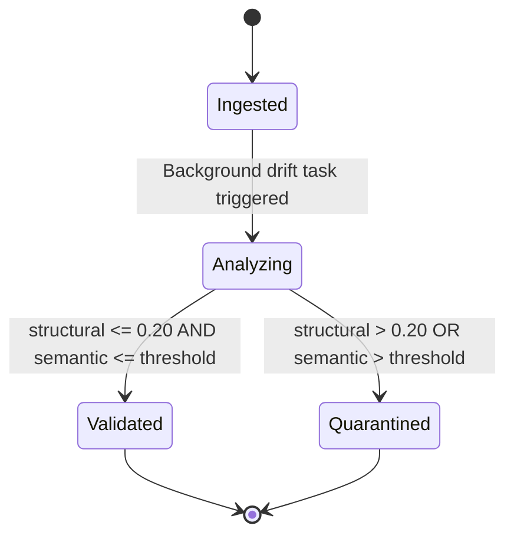

# Architecture Diagrams

## 1. Component Diagram

## 2. Sequence Diagram — Single Data Pull Lifecycle

## 3. State Machine — ScrapeEvent Lifecycle

> Note: the semantic threshold shown here is intentionally not hardcoded as a number — see the README's [Drift Detection Engine](../README.md#the-drift-detection-engine) section for the current docs/code discrepancy (`0.35` documented vs. `0.55` in `drift.py`).
